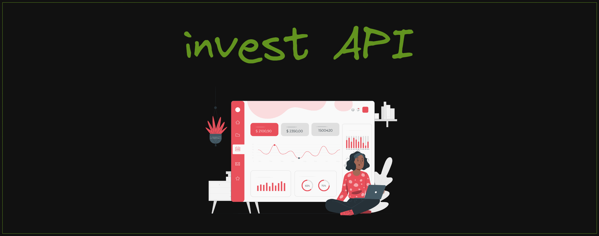
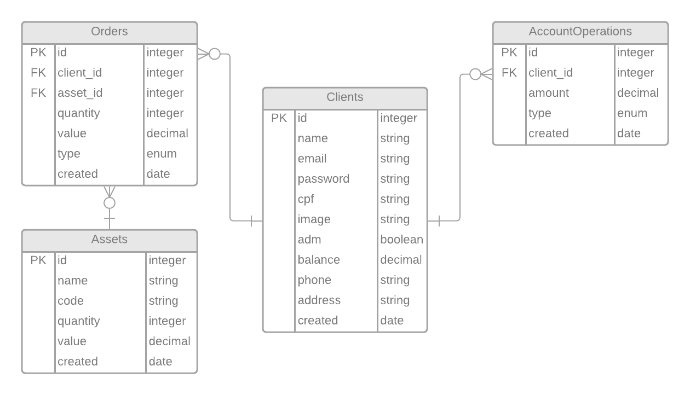
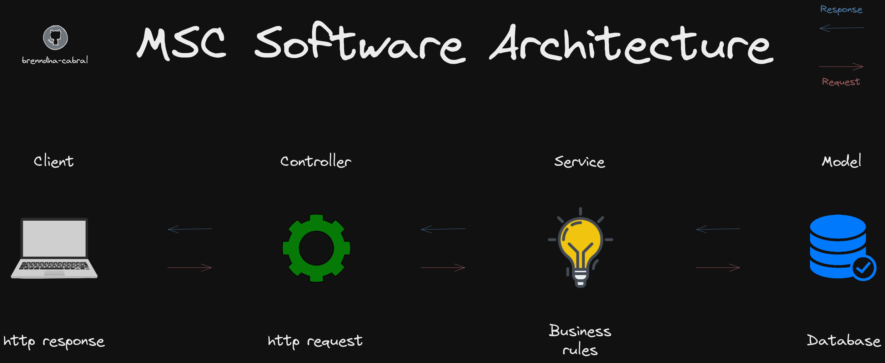

# Projeto API de Investimentos :dollar:

 

<h2>Índice</h2>

 :round_pushpin: [Sobre](#sobre) 
 :round_pushpin: [Tecnologias](#tecnologias) 
 :round_pushpin: [Decisões](#decisoes) 
 :round_pushpin: [Orientações](#orientacoes) 
 :round_pushpin: [Usabilidade](#usabilidade) 
 :round_pushpin: [Documentação](#documentacao) 
 :round_pushpin: [Scripts](#scripts) 
 :round_pushpin: [Testes](#testes) 
 :round_pushpin: [DER](#der) 
 :round_pushpin: [Arquitetura](#arquitetura) 
 :round_pushpin: [Referências](#referencias) 
 
<h2 id="sobre">Sobre</h2>

Esta aplicação tem como objetivo gerenciar investimentos em ações, com algumas funcionalidades de conta digital :bulb:

 - Esta é uma aplicação em `Node.js` com `Express` usando o pacote `Sequelize` para fazer um CRUD de investimentos.
 - Esta aplicação seguiu os princípios do REST e se conecta ao banco de dados `postgreSQL` através do [supabase](https://supabase.com/).
 - Para acessar a API, é necessário que a pessoa usuária faça login com suas credencias e isso será autenticado e autorizado via JWT com a geração de token.
 - É possível também que a pessoa usuária possa se cadastrar e utilizar a API, a partir disso é gerado um token para acesso a API.

<h2 id="tecnologias">Tecnologias</h2>

  
  
  
  
  
  
  
  
  

<h2 id="decisoes">Decisões</h2>

  [ESLint](https://eslint.org/)

- O projeto possui regras estritas de ESLint (Airbnb) para JavaScript onde é possível encontrar e corrigir problemas, seguindo boas práticas e padronização.

 [Docker](https://www.docker.com/)

- Utilizar imagens Docker para empacotar toda a aplicação e suas dependências, torna a distribuição mais fácil, segura e padronizada.

 [Sequelize](https://sequelize.org/)

- Como uma das bibliotecas de ORM mais conhecidas, o Sequelize foi utilizado nesse projeto pois o código se torna mais legível, extensível e de fácil manutenção.

 [PostegreSQL](https://postgresql.org/)

- Além da usabilidade simples, ele suporta um intenso fluxo de dados com garantia de estabilidade e segurança.

 [JWT](https://jwt.io/)

- Os JSON Web Tokens representam a autenticação e autorização de forma eficaz e simples.

<h2 id="orientacoes">Orientações</h2>

<strong>:closed_lock_with_key: Arquivos example.env e .env</strong>
 
  
> :information_source: Você encontrará um arquivo `example.env` onde estarão as variáveis de ambiente utilizadas no projeto, duplique-o e renomeie-o apenas para `.env` e insira os valores nas variáveis de ambiente conforme sua utilização.
 
  

<strong>:whale2: Rodando com Docker x Localmente</strong>

### 👉 Com Docker

> :information_source: Rode o serviço `node` com o comando `docker-compose up`.

- Esse serviço irá inicializar um container chamado `invest_api`;

- A partir daqui você pode acessar o container `invest_api` via CLI ou abri-lo no seu editor;

> :information_source: Use o comando `docker exec -it invest_api bash`.

- Ele te dará acesso ao terminal interativo do container criado pelo docker-compose.

> :information_source: Ao rodar o docker-compose, ele automaticamente irá rodar os seguintes scripts:

- `npm install`: Irá instalar todas as dependências;

- `npm prestart`: Irá rodar os comandos para gerar as tabelas, models e seeders no database;

- `npm start`: Irá rodar a aplicação na porta `3000` pelo `nodemon`, ou adapte o docker-compose e o `.env` caso sinta necessidade.

### 👉 Sem Docker

> :information_source: É necessário que você tenha `npm` e `node` instalados em sua máquina.

> :information_source: Instale as dependências com `npm install`.

> :information_source: Rode a aplicação com `npm start` na porta `3000` pelo `nodemon`, ou adapte o `.env` caso sinta necessidade.

<h2 id="usabilidade">Usabilidade</h2>

_Obs: Veja a seção de [documentação](#documentacao) para entender melhor como funcionam as rotas._

> :information_source: Após rodar a aplicação localmente, você deverá acessar através de `http://localhost:{porta}/{rota}` 

- Algumas sugestões de clientes:

  :bulb: [HTTPie](https://httpie.io/) | :bulb: [Postman](https://www.postman.com/) | :bulb: [Insomnia](https://insomnia.rest/) | :bulb: [Thunder Client](https://marketplace.visualstudio.com/items?itemName=rangav.vscode-thunder-client)
  
> :information_source: Para acessar o deploy da aplicação, clique [aqui]() :rocket:

<h2 id="documentacao">Documentação</h2>

> :information_source: Acesse [aqui]() a documentação deste projeto onde constam mais detalhes sobre a estrutura da API.

<h2 id="scripts">Scripts</h2>

> :information_source: Aqui estão os scripts da aplicação para que você possa utilizar, lembrando que o `docker-compose` já irá rodar o `npm run prestart` e `npm run start`.

- `npm run test`: Irá rodar todos os testes unitários da aplicação;

- `npm run start`: Irá rodar a aplicação (automaticamente irá rodar o `npm run prestart`);

- `npm run dev`: Irá rodar a aplicação através do `nodemon`, como desenvolvimento;

- `npm run lint`: Irá apontar todas as inconcistências de `lint`;

- `npm run lint-fix`: Irá corrigir o máximo de inconcistências de `lint` automaticamente.

<h2 id="testes">Testes</h2>

> :information_source:

<h2 id="der">Diagrama Entidade Relacionamento</h2>

 

<h2 id="arquitetura">Arquitetura</h2>

Este projeto foi elaborado nos padrões da arquitetura MSC onde existem três camadas:

- **Camada de Modelo (M)**: Arquivos que executam as operações do banco de dados, como criar conexões e executar queries;

- **Camada de Serviço (S)**: Arquivos que estruturam as regras de negócio, geralmente é quem chama os métodos definidos na camada de modelo;

- **Camada de Controladores (C)**: Interface mais próxima da pessoa usuária ou de uma requisição, irá processar e chamar as devidas funções da camada de serviço.

 

<h2 id="referencias">Referências</h2>

> :information_source: Este projeto foi a realização de um case para o cargo de Backend da empresa [XP Inc.](https://www.linkedin.com/company/xp-inc/)
